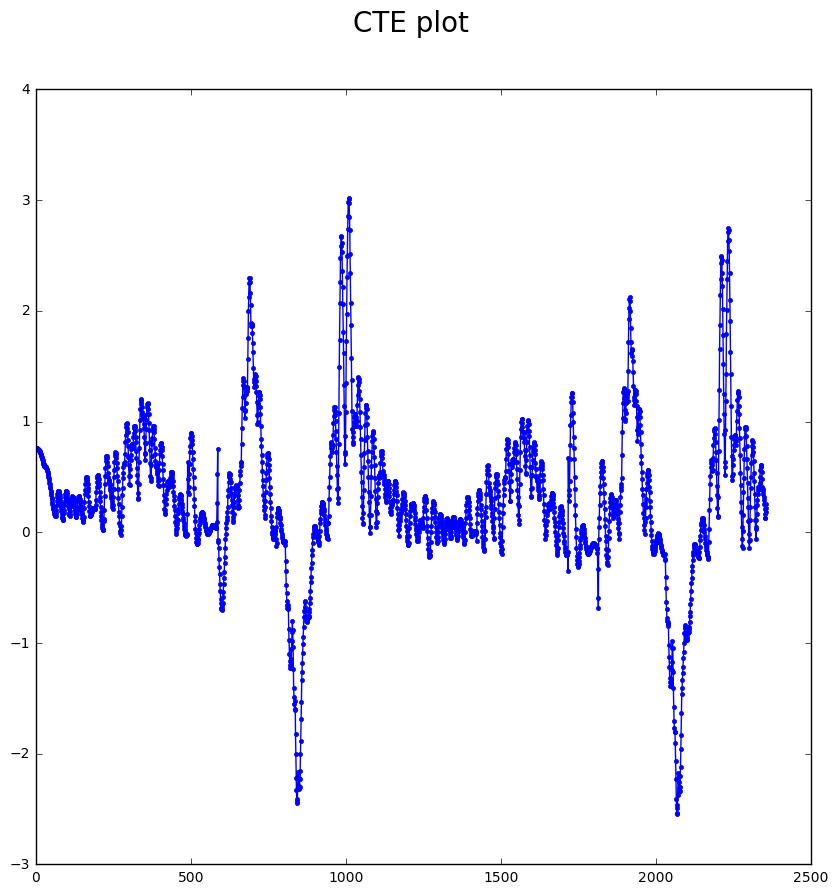
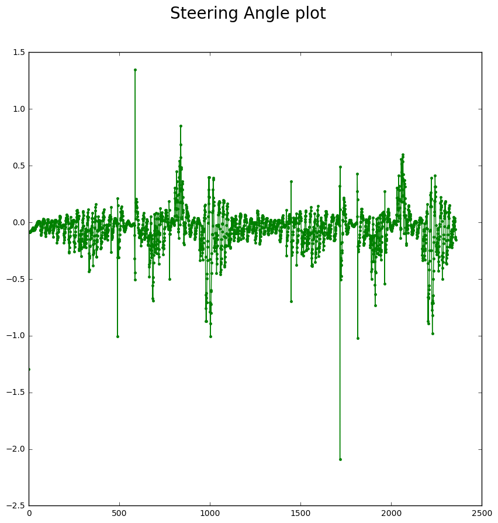

# CarND-Controls-PID
Robbie Edwards

---

## Build Instructions

1. Compile: `cmake .. && make`
2. Run it: `./pid`.

## Introduction

This assignment presented the challenge of controlling a simulated car around a course by implementing a PID controller to output the vehicle's steering angle. Cross-track error of the vehicle's position was reported by the simulator and used as the input to the controller. Position error was measured and used to control the steering rate. A PID controller was also implemented to control the vehicle's speed. The setpoint of the speed controller was decreased when the PID controller requested large steering angles.  This assignment is submitted with a 40mph speed setpoint. The vehicle does not leave the track, but it may occasionaly touch a lane marker on sharper conrners.

This assignment presented the interesting challenge that the required setpoint was continuously changing as the car drove around varying curvature on the track. The output was the combined effect was the response of the controller, with the changing setpoints for turn rate.

## Parameters

 - Kp: Increasing Kp would lead to oscillations around the setpoint as described in the lectures. Using too low a Kp would result in a system that responds slowly and would not always be capable of following the tighter curves.
 - Ki: Using an integral term appeared to allow the vehile to drive smoothly around high radius turns. It was likely not necessary to complete a lap, but allowed the controller to lock on to a turn rate and prevent oscillations resulting from just P and D on long turns. Allowing the i_error to accumulate too high would result in the vehicle not being able to acheive turns in the opposite direction as the output of Ki*i_error was slow to respond. Ki was set large enough to respond resonably quickly to changes in the direction of curvature but constrained to a maximum output.
 - Kd: The derivative term was found to provide damping as expected. If the term was set too high, the car would take sharp corrections leading to instability when it turned around sharp corners and the rate of increase of CTE became large. Once a suitable Kd was found, it was lowered as much as possible to avoid jittering.

## Parameter selection

Manual tuning was used for this project. Although machine based optimization of the PID parameters is interesting, I have not spend much time manually tuning PID controllers and thought this would be good practice. I've tuned a few flight controllers on RC aircraft but rarely get the chance to directly witness the effects of changing each of the parameters in detail.

For tuning:

1. Tuning was started with very low Kd and Ki=0 terms
2. Kp was increased until oscillations were observed as the setpoint was changed. The setpoint changed frequently as the car drove around a track of various curvatures.
3. Kd was increased and damping of the oscillations was observed. At a certain point, the car would drive erratically around tight corners as d(CTE)/dt became large. Kd was decreased until normal behavior was recovered.
4. Ki was introduced. It was found that if the I term was allowed to get too large, the car may not drive around tight corners in the opposite direction in which error was accumulating. A maximum on the i_error was implemented to avoid this problem. The max i_error was set low enough to avoid effects on steering in the opposite direction. The K_i term was set high enough that error would accumulate or decrease quickly enough to respond to changes in curvature.
5. These parameters were manually adjusted from here to confirm the effects and sensitivity of adjusting each parameter.
6. It was found that a given tuning was only valid for a certain speed range. The settings supplied appear to work between 35 and 45mph.

## Plots

The following plots show the input CTE error and the output steering angle data. The CTE is a good measure of performance of the controller. in this case oscillations are present and CTE grows large around some areas, likely corners. The output steering angle contains small oscillations with some large adjustments in some areas.

## Considerations and improvements

For implementing a Twiddle or Gradient descent approach for parameter selection, one would need to evaluate a measure of the accumulated cross-track error or average cross-track error. Ideally this should be done over the whole course to ensure the controller is tuned for all curves and won't fail in sections of the course. This would require an automatic means of evaluating when the car completes a lap or gets into an unrecoverable situation. Writing this interface to the simluator is probably beyond the scope of learning PID control. It could also work with painful human intervention. 1 lap evaluations would also require considerably long times for an optimizer to explore the parameter space, especially given the potential non-linearity of the response to PID parameters.

A paramter tuner optimizer may likely be implemented more efficiently over short intervals. It would be convenient if the both the set-point did not fluctatute as the car drives around the course and if the setpoint and error were reported.

There is likely an error in the calculation of delta time. The dt was measured at approximately 0.001s according to the ctime clock() function in a similar way to the Kidnapped Vehicle Project. But only 3000 data points were recorded during one lap, taking longer than 3 seconds.
